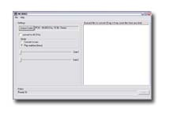

AC3DECODER
==========

# ABOUT

This program will convert and/or extract ac3 streams from VOB file formats into WAV formats.

It decodes audiostreams of Dolby-AC3 format, and sends a
downmixed stereo-signal to a Windows waveOut device.  The device must
support the stereo playback at the coded sample-rate (32, 44.1, or 48KHz.)

AC3DEC_WAVE can optionally create an RIFF WAV file, by using the
Windows ACM library.  ("Audio Compression" must be installed!)
Currently, the only fully working "codec" is standard PCM.

Some of the other codecs work, but a few don't.  The ADPCM codecs
and Windows Media Audio Codec(s) do not work.

This is a modified and recompiled version of Aaron Holtzmann's
freeware AC3DEC-0.5.4 software decoder, available from
( NEW ) http://ess.engr.uvic.ca/~aholtzma/ac3
( OLD ) http://www.engr.uvic.ca/~aholtzma/ac3

The VOB-demuxing routines are supplied by Brent Beyeler's BBDMUX.
Source code for BBDMUX is available from
http://members.home.net/beyeler/

#Usage
-----
  ac3dec.exe is a Win32 command-line application.  It must be run from
  a DOS-box.

          C:\> ac3dec.exe <AC3 file>  [optional output filename]

  If the output-filename is supplied, ac3dec will create a WAVE file.
  Otherwise, the decoded audio samples are sent to a waveOut device.
  AC3DEC can only play AC3 bitstreams.  AC3 Bitstreams may be in raw
  form (*.AC3) or part of an unencrypted VOB file.  AC3DEC does not
  play MPEG-audio streams.

  Playback control is very limited : <PAUSE> and <QUIT>

  (A Directshow version of AC3DEC is in the works.  When finished,
  the Directshow-filter will decode AC3-content from within any
  Directshow filtergraph, or Windows Media Player control.)

#Requirements
--------------------
  * 1) Windows Platform
  * 2) Windows soundcard with 16-bit stereo playback @ 32/44.1/48KHz
       *** AC3DEC cannot convert between samplerates ***
  * 3) Audio Compression codecs (optional, required for RIFF WAVfile output)

  The last requirement will cause problems for legacy ISA soundcards.

  Nearly all AC3 bitstreams are coded @ 48KHz.  And the most popular ISA
  soundcard in history, Creative Lab's Soundblaster, does *NOT* support
  48KHz sampling.  If you have a PCI Soundblaster, you are O.K.

  If you have an ISA Soundblaster board (SB-16, AWE32, AWE64, etc.),
  you probably can't play AC3 files (but you can still convert AC3 -> WAV.)
  The SB-16WAVEFFECTS is the only ISA Soundblaster with 48KHz support!

#Notes (...known limitations)
----------------------------
  The Wave-writer currently doesn't work with MS Audio Codec, IMA/Microsft
  ADPCM.  The wave-writer will *NEVER* work with MS Audio Codec (or
  Windows Media Audio.)  Microsoft does not permit these codecs to be
  accessed through ACM, only through the Windows Media API.

  AC3DEC is not "Dolby certified."  There may be some AC3 bitstreams
  that cause AC3DEC to crash.  Furthermore, 2.0 (stereo) bitstreams do not
  sound "quite right."  With 2.0 bistreams, treble sounds attenuated and
  base sounds over-emphasized.

  Bad AC3 bitstreams can cause ac3dec to crash.

  Performance-wise, AC3DEC is slow compared to commercial implementations
  of the Dolby-AC3 decoder.  On the development system (Celeron-450),
  XingDVD 2.03's AC3-filter consumes *HALF* as much CPU time.

  AC3DEC executes single-precision FPU instructions, favoring Intel CPUs
  over non-Intel CPUs.  On the Intel CPU, FPU-multiply is pipelined,
  whereas 32-bit integer multiply is not, so it's actually faster this way.

  ** multi-channel AC3 files ( >2 channels) are downmixed to a
  Dolby Pro-Logic compatible signal, but the mixing-levels may be incorrect.
  (The downmixing routines haven't yet been formally verified.)

  In play mode, AC3DEC_WAVE cannot deal with samplerate changes 
  in the ac3 bitstream (i.e. a change from 32KHz to 48KHz.)  This is a 
  limitation of the Windows waveOut API, and my output_winwave.c
  implementation.

  The VOB-demuxer is restricted to demuxing stream ID 0x80BD.  The next
  release will allow the user to specify the desired bitstream ID.

#Missing features
----------------

  Not all features of the AC-3 specification are implemented.
  Here's a list of features that are *NOT* implemented :

    1) dynrng (dynamic range control)
    2) compre (wide dynamic compression control)
    3) dialog normalization

  Rest assured these operations would be performed after decoding.
  Thus, their omission will not cause bitstream parsing/decoding errors.
  But ac3dec's output may sound different from a commercial AC-3
  implementation (like those found in softDVD programs.)

#Compilation
-----------
  Visual C++ 6.0 Professional
  To recompile this application, simply create a new Win32-console
  project, and add files with extension (*.c, *.cpp, *.h)
  Remember to remove output_linux.c, output.c, and output_solaris.c.
  (These source-files target other O/S.)

# Revision history 

v0.8.21
Speed improvements. Also is fixed the effect where it wouldn't do anything when redoing a new conversion.

v0.8.20
Ok finaly a new version, whats new? well like mpeg2avi PX3 0.1.4 , I am going the GUI, but unlike them, being one step smarter/cooler and making it work in both GUI and CONSOLE mode, so if its run from an icon its in gui, if its run with args or from dosprompt it acts like the old cli version. Har! Now why did I make it gui ? You can just drag/drop the ac3 files on it and snooze for 13mins.

v0.8.19
-seek to HH:MM:SS timecode in ac3's added

v0.8.18
-loadcodec/-savecodec to use codecs without gui
-44100 option is now of higher quality
output should be generaly of better quality
I have used the various bits of the latest ac3dec0.6.x from the linux version, but some obviously changed too much so Id rather not totaly mod that release all over again (though id love to take out the bbdmux layer and use my fast/lean decoder instead, a combo of decodevob/ac3dec is faster than decoding a vob to a wav from the beginning)
I would still like to integrate the xing mp3 encoder DLL, and 5.1 output (3 wavs), perhaps a plugin output architecture??? Also compiling with intels VTune compiler could be better too than MSs.

v0.8.17
added -pcmwav so you can automaticly output to pcm wavs without chooser box

v0.8.16
status output fixed where it wouldnt wrap to next line.

v0.8.15
better seeking to ac3 data.
insertms option added to add blank silence at the front.
aac stuff is still in beter, its in the source but commented out because its not working.

v0.8.14
buffered write can be set to any size, and some other new args too.
last buffer also is saved properly.

v0.8.13
Optimized mantisas to be faster (3%), still the bbdemux code is holding it back the new vob decoder has not yet been inserted.
Added buffered output, so only every 300k is written, not every small block.
All in all should be faster.

v0.8.12
Nothing amazing, just a SkipForward/Backword command in realtime listening.
So if its working for you, no need to download it.

v0.8.11
Fixed high pitch sound errors, I hope.

v0.8.10
made status nicer so it doesnt overlap 80 columns
we now have a beta in_ac3.dll plugin for Winamp
slightly speeded up math code too, but the de-mux is whats killing its speed now, that is hell crap code that needs replacement soon.
Btw, I forgot to mention that the -44100 conversion option seams to work ok.

v0.8.9
added fixed elapsed time value (blame old relic code from mpeg2avi) added heaps of realtime options for switching streams/ changing volumes
fixed -length option where it would do one more second before

v0.8.8
again, fixed the EOF detection for all levels, should be ok now.
made -info act just like BBDMUX spanning is 100% now with correct EOF checks etc... version info printed all the time

v0.8.7
again, fixed the EOF detection for all levels, should be ok now.
added more stat info at the end for 'jmm'

v0.8.6b
fixed reading of ac3 files, detects EOF nicely, sorry, there was lots of messy code to go through.

v0.8.6
fixed writing last segment of data, and added more precision to output seconds status, fixed ac3 input reading. Thanks for checking DanniDin.

v0.8.5
correctly does multi vob spanning, ie doesnt miss packets and works together with any stream
added option to kill rear/centre/lfe channels if you want to.

v0.8.4
hopefully a bit more speedier, if you notice
- more stats/info in realtime

v0.8.3
50% faster so it can now basicly do 3x realtime decoding.
- added -info option to show VOB stream infos
- added -reargain for adjusting audio
- its handles premature ending VOBs nicely, without failing/falling over
- added more stats to the status texts

v0.8.2
Audio center channel gain added
- Seek option now works properly
- the substream option works now correctly, finaly
- added max length ability, so you can decide to only
decode 10 minutes or 83 minutes exactly, either use HH:MM:SS or seconds value

v0.8.1
substream args fixed, whoops
- added another inverse squared curved gain control to volume enhancement use as -gain2 {1...900} just experiment

v0.8
Audio output gain added, use -gain 1 to 500 for percent.
it is a sliding gain, so only quieter sounds are made louder without the loud sounds distorting.

v0.7
audio downmixes speedups for other downmix combos
added working multivob support, any blah_1.vob goes to blah_2.vob etc.. until 9
substream support added via -substream command, use 0x81 or 0x80 as the hex codes
* gain control is coming

v0.6
handles more codecs much faster decoding
handles stdin via -- filename (experimental)
cool processing speed statistics
* multi vob source support is in experimentation
* ground work being done for 48000hz to 44100 live conversion

v0.05
updated bit_allocate.c (0.5.5), should fix compatibility problems with some AC-3 bitstreams.
corrections to downmix.c, rematrix.c,
added phase-inversion to uncouple.c
minor cosmetic changes (statistics report) to user interface

v0.04
lfe-channel now mixed at +10dB (instead of +9dB)
improved resistance to "bad AC3 frames"
updated downmix module (still not thoroughly tested)

v0.03
ac3dec_mci renamed to ac3dec_wave, to avoid confusion
added ACM (audio compression manager) support, file output
added downmix module

v0.02
integrated BBDMUX with ac3dec_mci, allows ac3dec
to directly demux AC3 audiostream (0x80BD) from *.VOB files
(unencrypted VOB files only!)

v0.01
first release of AC3DEC for Win32 (ac3dec_mci),
output to Windows wave routines (waveOut library)

## LICENSE

Permission to use, copy, modify, and/or distribute this software for any
purpose with or without fee is hereby granted, provided that the above
copyright notice and this permission notice appear in all copies.

THE SOFTWARE IS PROVIDED "AS IS" AND THE AUTHOR DISCLAIMS ALL WARRANTIES
WITH REGARD TO THIS SOFTWARE INCLUDING ALL IMPLIED WARRANTIES OF
MERCHANTABILITY AND FITNESS. IN NO EVENT SHALL THE AUTHOR BE LIABLE FOR
ANY SPECIAL, DIRECT, INDIRECT, OR CONSEQUENTIAL DAMAGES OR ANY DAMAGES
WHATSOEVER RESULTING FROM LOSS OF USE, DATA OR PROFITS, WHETHER IN AN
ACTION OF CONTRACT, NEGLIGENCE OR OTHER TORTIOUS ACTION, ARISING OUT OF
OR IN CONNECTION WITH THE USE OR PERFORMANCE OF THIS SOFTWARE.

